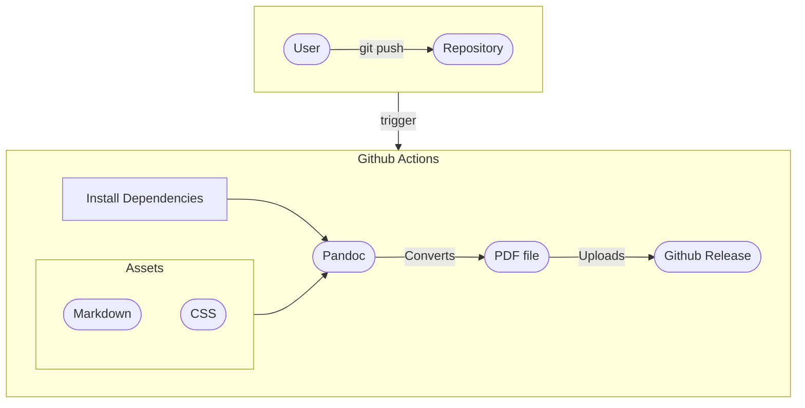

In this guide I will show you how to setup [Github Actions](https://docs.github.com/en/actions) to generate your CV and upload it to your [project release](https://docs.github.com/en/repositories/releasing-projects-on-github).

## How does it Work?
When you push changes to `main` a workflow starts, that workflow uses [pandoc](https://pandoc.org/) to convert `markdown` to `pdf`.

A diagram of the workflow looks like this: 



## Repository Layout
The basic file tree that we will create will look like: 


  
    
      
    
  
  
    
    
  
  
    
  
  


Let's discuss each file and directory in more details:

### `markdown` Directory 
Let's you define multiple versions for your CV. 

Let's say you have a CV for a developer role and also a CV for a sysadmin role,
while you can technically have separate git branches, I found that it's not convenient to deal with branches when you want to edit shared assets like the CSS or workflow file.

#### `Fname_Lname.md` 
This is where your CV content goes. Simply write your CV in markdown format.

For example:

```markdown {filename="markdown/John_Doe.md"}
# John Doe

#### Senior developer that puts a lot of attention to security
###### [ [ john_doe@example.com ](mailto:john_doe@example.com) ] . [ [ +111-22-333-4444 ](tel:+111-22-333-4444) ] . [ [ Github ](https://github.com/ShaharNaveh/) ]

## Experience

### **Software Devloper @ Example Company** (1970-Preset)

Screamed at screens to get things done.

## Skills

- Version Control & CI/CD: Git, Github Actions

- Networking: Advanced expertise in networking and internet protocols

## Additional Information
- Languages: English(native), Italian(fluent)
```

### CSS 
If we look at the [repository layout](#Repository-Layout) again you'll see two `.css` files: 

#### `normalize.css`
CSS file that ensures all components renders the same, no matter which browser it was opened in.

You can grab the latest version [here](https://necolas.github.io/normalize.css/) 

#### `default.css`
Where the actual styling goes. This is where you decide on things like:

- Background Color
- Font Family
- Font Size

And a lot more.


It's recommend to import `normalize.css` from `default.css` like so:

```css
@import "normalize.css";
```




You can grab a base `default.css` file [here](assets/default.css).


### Justfile
Configuration file for [just](https://github.com/casey/just).

In short, it let's us save and run predefined commands easily.

Our Justfile looks like this: 

```justfile {filename="Justfile"}
out_dir := "output"
in_dir := "markdown"
css_file := "css/default.css"

build: init
        for md_file in {{in_dir}}/*.md ; do \
        FILE_NAME=$(basename $md_file .md); \
        echo $FILE_NAME; \
        pandoc \
        --standalone \
        --self-contained \
        --css {{css_file}} \
        --from markdown \
        --to html \
        --metadata title=$FILE_NAME \
        --output {{out_dir}}/$FILE_NAME.html $md_file > /dev/null; \
        \
        pandoc \
        --standalone \
        --self-contained \
        --from html \
        --to pdf \
        --pdf-engine=weasyprint \
        --metadata title=$FILE_NAME \
        --output {{out_dir}}/$FILE_NAME.pdf \
        --css {{css_file}} \
        {{out_dir}}/$FILE_NAME.html; \
        done
init:
        mkdir -p {{out_dir}}

clean:
        rm -f {{out_dir}}
```


As you may notice we are generating the PDF in two steps:
1. Convert markdown to HTML
2. Convert HTML to PDF

The reason for that is that I just found it to be more stable with the CSS inline.

For the `pandoc` arguments, here is a short description on what each flag does:

- `--standalone`: something
- `--from`: Input format.
- `--to`: Output format.

