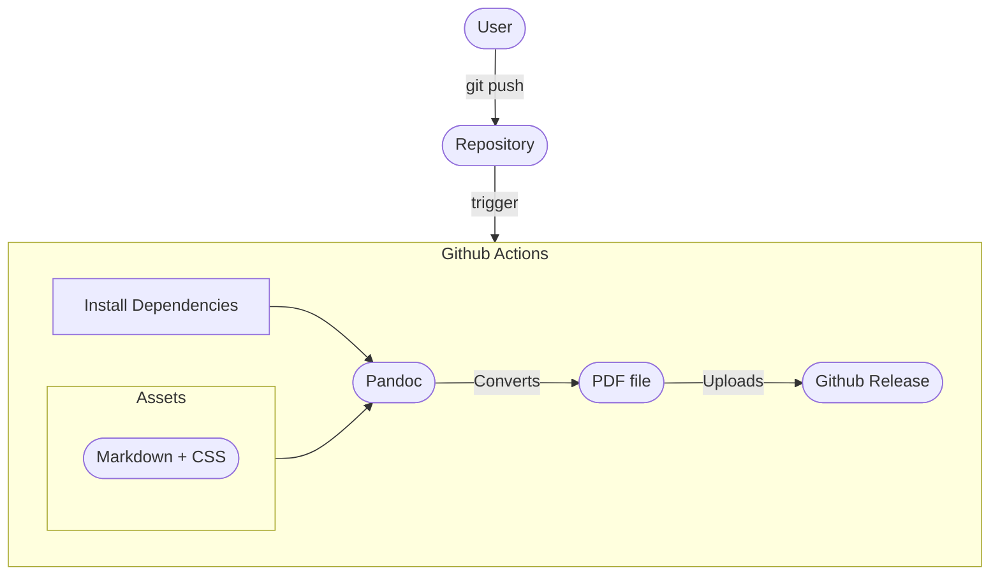
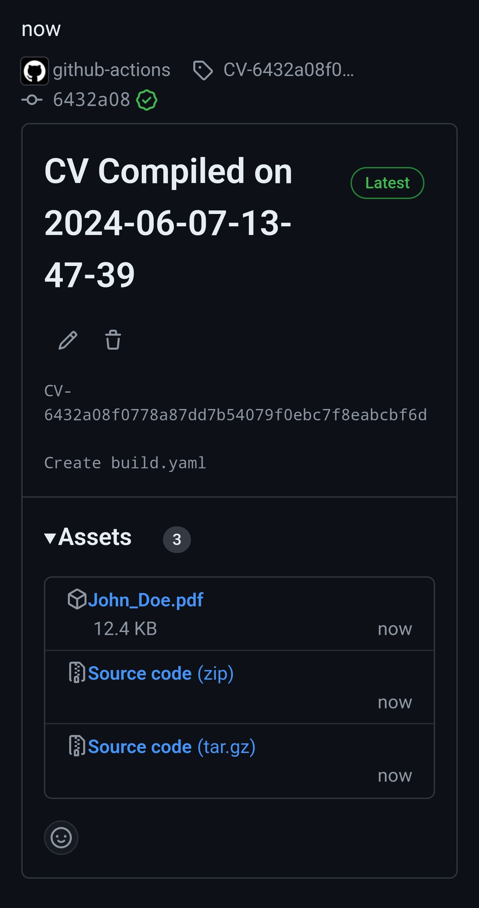

In this guide I will show you how to setup [Github Actions](https://docs.github.com/en/actions) to generate your CV and upload it to your [project release](https://docs.github.com/en/repositories/releasing-projects-on-github).

## How does it Work?
When you push changes to `main` a workflow starts. This workflow uses [pandoc](https://pandoc.org/) to convert `markdown` to `pdf`.

A diagram of the workflow looks like this: 



## Repository Layout
The basic file tree we will create looks like: 


  
    
      
    
  
  
    
    
  
  
    
  
  


Let's discuss each file and directory in more details:

### `markdown` Directory 
Allows you to define multiple versions of your CV.

For example, you might have a CV for a developer role and another for a sysadmin role. While you can use separate git branches, it's more convenient to edit shared assets like CSS or workflow files without dealing with branches.

#### `John_Doe.md` 
This is where your CV content goes. Simply write your CV in markdown format.

For example:

```markdown {filename="markdown/John_Doe.md"}
# John Doe

#### Senior developer that puts a lot of attention to security
###### [ [ john_doe@example.com ](mailto:john_doe@example.com) ] . [ [ +111-22-333-4444 ](tel:+111-22-333-4444) ] . [ [ Github ](https://github.com/ShaharNaveh/) ]

## Experience

### **Software Devloper @ Example Company** (1970-Preset)

Screamed at screens to get things done.

## Skills

- Version Control & CI/CD: Git, Github Actions

- Networking: Advanced expertise in networking and internet protocols

## Additional Information
- Languages: English(native), Italian(fluent)
```

### CSS
The [repository layout](#repository-layout) includes two `.css` files:

#### `normalize.css` 
Ensures all components render the same, regardless of the browser. You can get the latest version [here](https://necolas.github.io/normalize.css/).

#### `default.css` 
Contains the actual styling for your CV, including:

- Background color
- Font family
- Font size


It's recommended to import `normalize.css` from `default.css` like this:

```css {filename="css/default.css"}
@import "normalize.css";
```


You can find a base `default.css` file [here](assets/default.css).

### Justfile 
The [just](https://github.com/casey/just) utility allows us to save and run predefined commands easily.

Our `Justfile`:

```justfile {filename="Justfile"}
out_dir := "output"
in_dir := "markdown"
css_file := "css/default.css"

build: init
        for md_file in {{in_dir}}/*.md ; do \
        FILE_NAME=$(basename $md_file .md); \
        echo "Processing: $FILE_NAME"; \
        pandoc \
        --standalone \
        --self-contained \
        --css {{css_file}} \
        --from markdown \
        --to html \
        --metadata title='' \
        --output {{out_dir}}/$FILE_NAME.html $md_file > /dev/null; \
        \
        pandoc \
        --standalone \
        --self-contained \
        --from html \
        --to pdf \
        --pdf-engine=weasyprint \
        --metadata title='' \
        --output {{out_dir}}/$FILE_NAME.pdf \
        --css {{css_file}} \
        {{out_dir}}/$FILE_NAME.html; \
        done

init:
        mkdir -p {{out_dir}}

clean:
        rm -f {{out_dir}}
```

#### Explanation 
This Justfile automates the process of converting Markdown files to both HTML and PDF formats. Here's a brief overview of the commands:

- **build**: Runs the init command to create the output directory, then processes each Markdown file in the input directory:
  1. Converts Markdown to HTML.
  1. Converts HTML to PDF.
- **init**: Creates the output directory.
- **clean**: Deletes the output directory.

The conversion to PDF in two steps (Markdown to HTML, then HTML to PDF) is more stable with the CSS applied inline.

Key `pandoc` flags:

- `--standalone`: Generates a standalone file.
- `--from`: Specifies the input format.
- `--to`: Specifies the output format.
- `--self-contained`: Embeds resources (like CSS) into the output file.
- `--metadata title=...`: Sets the document title.
- `--output`: Defines the output file path.

### Github Action 
This workflow will be triggered on any `git push` to the `main` branch, you can push via your PC/phone/etc, and it will automatically generate your CV.

Our `build.yaml`:
```yaml {filename=".github/workflows/build.yaml"}
name: Build CV
on:
  push:
    branches:
      - main 
  # Allows you to run this workflow manually from the Actions tab
  workflow_dispatch:

permissions:
  contents: write
  
jobs:
  build-cv:
    runs-on: ubuntu-latest
    env:
      PYTHON_VERSION: '3.12'
      JUST_VERSION: '1.29.1'
      WEASYPRINT_VERSION: '62.2'
    steps:
      - name: Checkout
        uses: actions/checkout@v4
  
      - name: Install Python
        uses: actions/setup-python@v5
        with:
          python-version: ${{ env.PYTHON_VERSION }}
    
      - name: Install weasyprint
        run: pipx install 'weasyprint==${{ env.WEASYPRINT_VERSION }}'

      - name: Install pandoc
        run: sudo apt install --yes --no-install-recommends --no-install-suggests pandoc
     
      - name: Install just
        uses: extractions/setup-just@v1
        with:
          just-version: ${{ env.JUST_VERSION }}
    
      - name: Build
        run: just build
  
      - name: Set Environment Variables
        run: |  
          # Get PDF files
          echo "PDF_FILES<<EOF" >> $GITHUB_ENV 
          find output/ -type f -name '*.pdf' >> $GITHUB_ENV 
          echo "EOF" >> $GITHUB_ENV 

          # Get Current Datetime
          echo "NOW=$(date +'%Y-%m-%d-%H-%M-%S')" >> $GITHUB_ENV    
   
      - name: Release
        uses: softprops/action-gh-release@v2
        with:
          name: CV Compiled on ${{ env.NOW }}
          tag_name: CV-${{ github.sha }}
          files: ${{ env.PDF_FILES }}
```

## Wrap Up 
If everything is set up correctly, you should see a new release on the main repository page:


Clicking on it, you will see your PDF file(s) under "Assets":



You can get the generated PDF of the example [here](assets/John_Doe.pdf).
