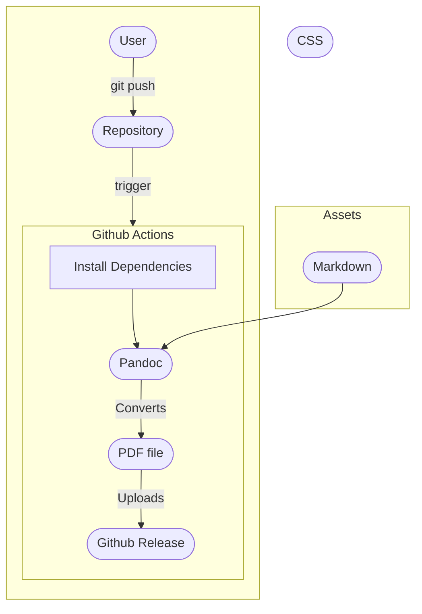

In this guide I will show you how to setup [Github Actions](https://docs.github.com/en/actions) to generate your résumé and upload it to your [project release](https://docs.github.com/en/repositories/releasing-projects-on-github).

## How does it Work?
When you push changes to `main` a workflow starts, that workflow uses [pandoc](https://pandoc.org/) to convert `markdown` to `pdf`.

A diagram of the workflow looks like this: 



## Repository Layout
The basic file tree that we will create will look like: 


  
    
      
    
  
  
    
    
  
  
  


Let's discuss each file in more details:


### `Fname_Lname.md` 
This is where your résumé content goes, simply write your résumé in markdown format.

For example:

```markdown {filename="John_Doe.md"}
# John Doe

#### Senior developer that puts a lot of attention to security
###### [ [ john_doe@example.com ](mailto:john_doe@example.com) ] . [ [ +111-22-333-4444 ](tel:+111-22-333-4444) ] . [ [ Github ](https://github.com/ShaharNaveh/) ]

## Experience

### **Software Devloper @ Example Company** (1970-Preset)

Screamed at screens to get things done.

## Skills

- Version Control & CI/CD: Git, Github Actions

- Networking: Advanced expertise in networking and internet protocols

## Additional Information
- Languages: English(native), Italian(fluent)
```

### CSS
