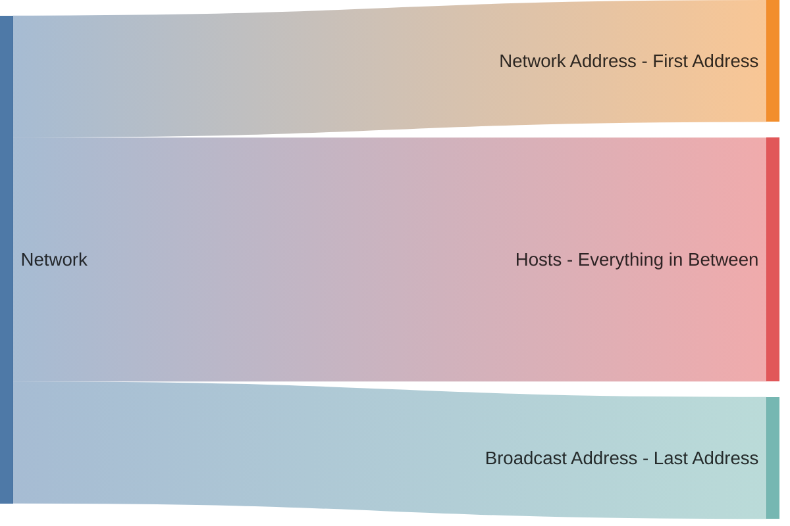

Understanding basic networking concepts is important in today's digital world. It helps people know how data moves, fix connection problems, and keep communications secure.
Knowing these basics is key to using modern technology.

## Why this Post?
This post provides a concise overview of basic networking flow, designed as a "Networking for Dummies" guide rather than a deep dive.

## What is a Network?
A network is a group of two or more computers that are interconnected for the purpose of exchanging data.

## IP Addressing 
Every machine, server and end-user device that connects to the internet has a unique number, called an IP address, associated with it. Devices find and communicate with one another by using these IP addresses.

An IP address has two parts:
1. The network address is a series of numerical digits pointing to the network's unique identifier
1. The host address is a series of numbers indicating the host or individual device identifier on the network

### IPv4 Structure 
An IPv4 address consists of 32 bits.
Each string of numbers separated by the period consists of 8 bits, represented by 0 to 255 in numerical forms.

| IPv4 | Valid? |
| --- | --- |
| 0.0.0.0 | :white_check_mark: |
| 127.0.0.1 | :white_check_mark: |
| 255.255.255.255 | :white_check_mark: |
| 256.256.256.256 | :x: |

## Network Parts
Every network can be divided to 3 logical parts:

1. **Network Address**: The first IP address of the network. Not owned by any device.
1. **Broadcast Address**: Last IP address of the network. Not owned by any device. 
1. **Host Address(es)**: All IP addresses in between.

## Netmask
Netmask are used to define a range of IP addresses of a network.

For example:

| Network Address | Netmask | Address Range | Total Number of Addresses |
| --- | --- | --- | --- |
| 127.0.0.1 | 255.255.255.255 | 127.0.0.1 - 127.0.0.1 | 1 |
| 192.168.0.0 | 255.255.255.0 | 192.168.0.0 - 192.168.0.255 | 256 |
| 10.0.0.0 | 255.0.0.0 | 10.0.0.0 - 10.255.255.255 | 16,777,216 |


There are 32 possible netmasks, you don't need to remember all of them.
Just use an [IP/subnet calculator](https://www.solarwinds.com/free-tools/advanced-subnet-calculator).


### Network CIDR Notation (aka subnetmask)
Instead of writing both the network IPv4 addresses & netmask when we want to describe a network, we can use a CIDR notation.

The CIDR notation is a suffix appended to the network address stating the number of bits allocated for the network address.
For example, instead of writing: `192.168.0.0 - 192.168.0.255` we can write `192.168.0.0/24`.

While there are 32 possible CIDR notations, you need to remember only 5 by heart:

| CIDR | Netmask | Address Range Example | Total Number of Addresses |
| --- | --- | --- | --- |
| /0 | 0.0.0.0 | 0.0.0.0 - 255.255.255.255 | 4,294,967,296 |
| /8 | 255.0.0.0 | 10.0.0.0 - 10.255.255.255 | 16,777,216 |
| /16 | 255.255.0.0 | 192.168.0.0 - 192.168.255.255 | 65,536 |
| /24 | 255.255.255.0 | 192.168.0.0 - 192.168.0.255 | 256 |
| /32 | 255.255.255.255 | 127.0.0.1 - 127.0.0.1 | 1 |





## Subnetting

## Terminology
### Network Types
There are many network types, but we are going to focus on two types: `LAN` and `WAN`

| | LAN | WAN |
| ---  | --- | --- |
| Stands For | Local Area Netowrk | Wide Area Network |
| What People Actually Mean | Private Network | The Internet |
| Example | Your Home/Office Network | The Internet |


You can read more about available network types [here](https://en.m.wikipedia.org/wiki/Computer_network#Geographic_scale).


