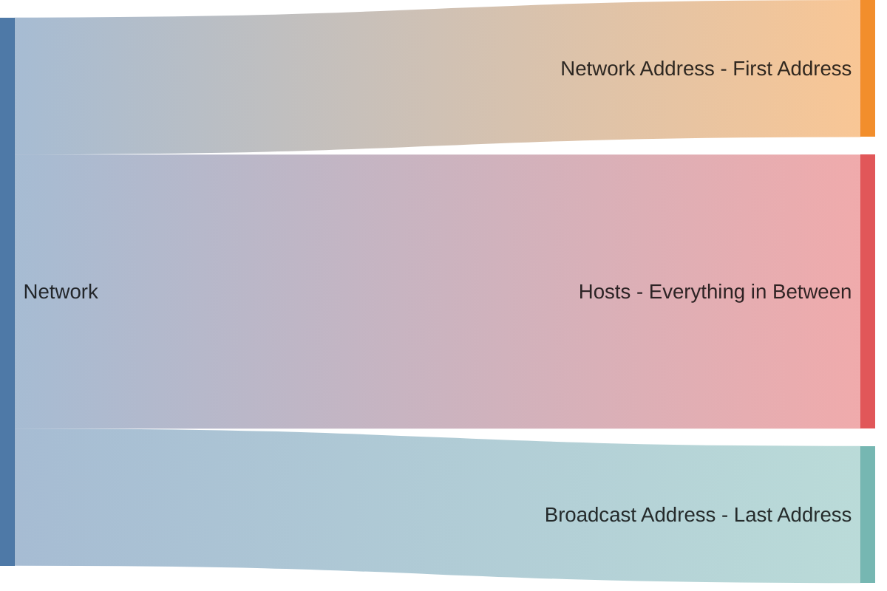

Understanding basic networking concepts is important in today's digital world. It helps people know how data moves, fix connection problems, and keep communications secure.
Knowing these basics is key to using modern technology.

## Why this Post?
This post provides a concise overview of basic networking flow, designed as a "Networking for Dummies" guide rather than a deep dive.

## What is a Network?
A network is a group of two or more computers that are interconnected for the purpose of exchanging data.

## Network Types
There are many network types, but we are going to focus on two types: `LAN` and `WAN`

| | LAN | WAN |
| ---  | --- | --- |
| Stands For | Local Area Netowrk | Wide Area Network |
| What People Actually Mean | Private Network | The Internet |
| Example | Your Home/Office Network | The Internet |


You can read more about available network types [here](https://en.m.wikipedia.org/wiki/Computer_network#Geographic_scale).


## IP Addressing
Every device on a network must be addressable. This means that it can be reached by referencing its address (usually an IPv4 address).

This IP address allows a device to communicate with another device using its remote IP address, assuming that they are on the same network. Every IP address must unique on its own network, meaning no two devices has the same IP address.

Imagine that if you want to send a letter to a friend, you would need his full address. That address is unique! No two houses share the same address.

### IPv4 Structure
An IPv4 is comprised of 4 numbers separated by a dot, each of those numbers can be between 0-255.

| IPv4 | Valid? |
| --- | --- |
| 0.0.0.0 | :white_check_mark: |
| 127.0.0.1 | :white_check_mark: |
| 255.255.255.255 | :white_check_mark: |
| 256.256.256.256 | :x: |

## Network Definition
Every network can be divided to 3 logical parts:

1. **Network Address**: The first IP address of the network. Not owned by any device.
1. **Broadcast Address**: Last IP address of the network. Not owned by any device. 
1. **Host Address(es)**: All IP addresses in between.

## Netmask
Netmask are used to define a range of IP addresses of a network.

For example:

| Network Address | Netmask | Address Range | Number of Addresses |
| --- | --- | --- | --- |
| 127.0.0.1 | 255.255.255.255 | 127.0.0.1 - 127.0.0.1 | 1 |
| 192.168.0.0 | 255.255.255.0 | 192.168.0.0 - 192.168.0.255 | 256 |
| 10.0.0.0 | 255.0.0.0 | 10.0.0.0 - 10.255.255.255 | 

### Network CIDR Notation
