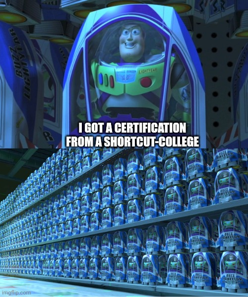

## Should I?
**The short answer is no, don't.**

You're probably seeing this post because you asked something like:

> Do you guys recommend \<SHORTCUT COLLEGE\> for \<JOB ROLE\>?

and someone linked this post as an answer.

---

## What Are Shortcut-Colleges?
Shortcut-colleges offer a condensed, hands-on approach to tech education, promising quick entry into the workforce with highly priced programs.

Their marketing slogan is:

> Get our course, and land yourself your dream job.

But the truth is, there's no magic bullet that guarantees success.


"shortcut-colleges" can be any course that sells you the idea that just by attending that course, you will get amazing job offers, and there is no need to put any effort of your own.


## Why Not?
Your goal is probably getting a high paying job with good working conditions and high-tech positions do offer that, but as this blog post will explain, shortcut-colleges can't give you what you're really after 😮

### You Need To Study On Your Own
There are no shortcuts, putting an effort for self-studies will be required to pass any decent technical interview.

In the fast-paced world of technology, adaptability and independent learning are crucial. One must know how to learn new topics from scratch without being spoon fed.

Even if a single course would bring you to be at the forefront of the industry (and it will never do so), your knowledge would be outdated in less than a year; you need to keep pace by learning on your own.

### Shallow Skillset
Tech is more than just coding. It's about problem-solving, creativity, and adaptability. Many shortcut-colleges focus narrowly on teaching specific commands/languages/frameworks/etc, while neglecting the broader skills and knowledge needed to thrive in the industry.

> give a man a fish and you feed him for a day. Teach a man to fish and you feed him for a lifetime

### Expensive Toilet Paper
You might think that the graduation certificate worth something to your future employer. think again...

Because the requirements for obtaining the certification are zero to none, it does not show hard work or knowledge, so anyone can get it and it doesn't make you special.

## FAQ
## But I Got A Scholarship From Them
Those are lousy marketing tactics.

They inflate the price, then giving you a test to see "if you are worthy". Regardless of your grade, you will get a discount/scholarship from them for your high intellect. Giving you the feeling of appreciation while all they care about is the money (capitalism in a nutshell).

### But It's Hard For Me To Study On My Own
Motivation and self-discipline are a must for any tech related position.

If you **really** can't do it then you need to rethink your career choices.

### But My Contract With Them Requires Them To Get Me A Job
Some shortcut-colleges are promising an entry-level position upon course completion, with the sweet benefits of getting:

- Extremely underpaid
- Exploited
- No promises of not getting fired after a month

There are a lot of fine-print you need to lookout for such as:

- They are only responsible for getting you a job interview, not an actual offer 
- They are doing their side by giving you an offer, if you don't sign it. It's on you
- \<INSERT EVERY SCUMMY METHOD KNOWN TO MEN\>

Not so fun to spending your life savings for a certification that's better used as toilet paper.
